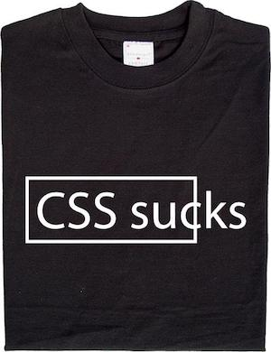

# Intro to SASS: CSS on steroids
#### As part of the #WOCO.HK Frontend Series

Hosted by Denis Tsoi  
@denistsoi (twitter)  

## Let's get it started... prerequisites:
-  Basic (CSS)[http://pumpula.net/p/apps/css-vocabulary/]



## scss is not...

  

## What is scss?

1. nested CSS
2. variables
3. mixins
4. arguments (functions)
5. extends
6. imports and partials

### Bonus:
1. Indented scss  
2. compass (scss Extension)  

## 1. nested css

before
```
body {
  /* some css */
}

body div.container {
  display: block;
  position: relative;
  /* some more .container css */
}

body .container .content {}
body .container .content ... more classes {}
```

now
```
body {
  /* some css */
  div.container {
    display: block;
    position: relative;
    .content {
      /* content css */
    }
    ... more classes { /* more css */ }
  }
}
```

alt
```
body {
  /* some css */
}

div.container {
  display: block;
  position: relative;
  .content {
    /* content css */
  }
  ... more classes { /* more css */ }
}
```

but why not just use specificity?  

## 2. Variables

```
$page-width: 768px;
$cool-blue: #0CA8EB;

body {
  width: $page-width;
}

nav li.active {
  background: $cool-blue;
}
```
You can also use math!!!

```
$size1: 10px;
$size2: 20px;
$size3: 30px;

$totalsize = $size1 + $size2 + $size3;  // 60px
$averagesize = $totalsize / 3; // 20px
```

## 3. mixins
Mixins are reusable snippets of code
(without the use of css classes)

```
.some-style {
  margin: 0;
  padding: 0;
  line-height: 12px;
  font-size: 12px;
  font-weight: normal;
  /* some more stuff */
}

.some-similar-style {
  margin: 0;
  padding: 0;
  line-height: 16px;
  font-size: 16px;
  font-weight: normal;
  /* some more stuff */
}
```

```
<div class="some-style"></div>
<div class="some-similar-style"></div>
```

so you could do something the following without scss

```
.some-common-style {
  margin: 0;
  padding: 0;
  font-weight: normal;
}

.some-style {
  /* custom css */
}
.some-similar-style {
  /* custom css */
}
```

```
<div class="some-common-style some-style"></div>
<div class="some-common-style some-similar-style"></div>
```

but what if you want to minimize the population of css classes in your html markup?

this is where mixins come into play;

```
@mixin commonstyle {
  margin: 0;
  padding: 0;
}

.main,
.detail {
  @include commonstyle;
}
```

```
<div class="main"></div>
<div class="detail"></div>
```

but reusing the `commonstyle` mixin above is only useful if the values are predefined...

## 4. arguments

```
@mixin commonstyle($padding, $margin: 0) {
  margin: $margin;
  padding: $padding;
}

.main,
.detail {
  @include commonstyle(0);
}
```

but lets use an earlier example

```
@mixin font($font-size: 12px, $line-height: 12px, $font-weight: normal) {
  font-size: $font-size;
  line-height: $line-height;
  $font-weight: $font-weight;
}

.main {
  @include font;
}
.detail {
  @include detail(16px, 16px, bold);
}
```

## 5. extends

With `extends`, you might be working on a `css class` and later down the line, you want to 'inherit', the styles from a specific `class`.

You can use `@extend .selector` such that

```
.class {
  @extend .predefined;
}
```

`.class` will be populated with `.predefined`. This is particularly useful when we use a component based approach to development, such that `componentA` is able to use `componentB` where they may not need to use a mixin or import componentA styles.

## 6. imports and partials
Remember... `_filename` is a partial,
whereas `filename.scss` will be compile to a separate scss file

other tips/tricks
Using "&" as ' parent' selector...

```
li{
  width: 30px;
}
 li:hover{
  width: 100px;
}
li {
  width: 30px;
  &:hover {
  width: 100px;
  }
}
```

### update
Update:
Since sass 3.x.x, the popularity of using `{}` and `;` notation for scss, the popularity of using scss plays a lot nicer, such that scss isn't as strict when it comes to say, tab spacing.


## how to use from cli

There are a few ways to getting started.
From the sass-lang site, you can use the `ruby-gem` as follows.

```
sass <input.sass> <output.css>
```

example:
```
$ sass input.sass output.css
```

Watch one file
```
sass --watch app.scss:public/stylesheets
```

WATCH DIRECTORY
```
sass --watch app.scss:public/stylesheets
```
<!-- Lets take a break...
Live coding samples
Create a portfolio sample in 20 minutes or less.
http://cdpn.io/taiEf
what next?
Checkout COMPASS-Style  http://compass-style.org/
Experiment with Codepen (Sass/scss/less is provided)
Checkout -->

### Update: 2016-12-14
using scss with node
options:
- build tool (buildpack, webpack, gulp, grunt, yo etc)
- middleware (quesadilla)
- vanilla cli (`sass --watch`)

### Author
Denis Tsoi 

### License
  
Creative Commons Attribution License (do whatever, just attribute me) http://creativecommons.org/licenses/by/4.0/
