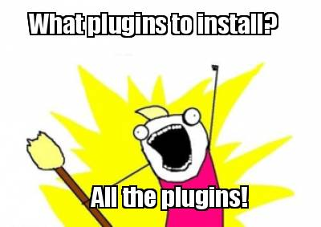

# 2017-01-01 wah liao so much frontend!

### Description

With 2016 being the epitome of JS fatigue, we will look at the top three frontend frameworks that has emerged.

Topics that we will cover are:
1. Overview of each framework.  
2. Comparing similarities and differences between each framework.

Throughout each framework, we will be moving towards using webpack, so having some knowledge on how to configure that is helpful.
However, it is not a necessary pre-requisite.

In another chapter, we will dive deeper into application state-management.

### Rundown

    1. Wah liao so much frontend!
      1.1 Part One - Looking at the 'View' layer
        1.1.1. Overview of Vue2   
        1.1.2. Overview of ng2  
        1.1.3. Overview of react  

      1.2. Part Two - Comparing the frameworks
        1.2.1. Similaries and differences.  
        1.2.2. Common backend to be paired for each framework.  
        1.2.3. Factors for choosing a particular framework.
        1.2.4. Extending components
      
      1.3. Part Three -  Plugins / all of the Plugins
        1.3.1. resources
        1.3.2. routers
        1.3.3. state-management
      The end - Comments/Questions
--- 

    2. aiya how to manage my state?  
      2.1. State-management Overview  
        2.1.1. vuex  
        2.1.2. rxjs  
        2.1.3. redux  
        2.1.4. mobx  
        2.1.5. alt (graphql example/setup)

## Part 2: Comparing frameworks

### 1.2.1: Similarities and Differences 

As a very high-level overview, if you're coming from say pre ng-1.4.x, a lot of the frameworks will look fairly new.
With bundling and usage of ES6 (or ESNext), it can get fairly overwhelming.

vue/ng2/react borrow quite a lot from another with varying degrees.

However, there are some main commonalities between the frontend frameworks such as:
- structuring your application as components.  
- usage of mixins/leveraging classes from es6.  
- bundling/code-splitting with webpack.  
- usage of Virtual DOM (if applicable).  

Differences include:
- template file extensions  
- usage/non-usage of js within template  
- boilerplating/tooling required for setup and LSA developement  

### 1.2.2 Common Backend to be paired for each framework  

The reason why I've added common backend to this section is primarily so that, given a specific backend, a developer may be able to find common libaries that are paried with the frontend.
Example, with PHP laravel, vue has been adopted at their frontend layer. For C#/.Net, ng2 is commonly found for applications due to ng2's support from Microsoft and type safety. 
For node, generally, you can choose any of the three, however, if you were to wanted to develop with React, you may or may not consider react-native for you application development.

### 1.2.3 Factors for choosing a particular framework

Other factors that may influence your decision may or may not be the ability to get a job with a particular framework. 
In order to acknowledge each framework, we should register the communities backing each framework, as a basis to choosing.

With vue, there is popularity from China/Japan, and as such, you may discover documentation that has been written in those languages.
This may detract you from your decision, however; it may allow you allow you find work there more easily in those specific areas.

With ng2, type safety and OOP patterns with TypeScript may couple nicely within your programming style. 
As such, this may be more accessible for you compared to functional/prototypical patterns with plain javascript.

With react, a common paradigm is functional programming. This may be more familiar to you, say coming from Haskell or Scala, and as such, may be more accessible.

Finally, another factor is from an individual programmers' perspective.

Due to the demand for competent programmers for a particular framework, there is generally a greater industry demand for developers with a background ng2 or react.
This may influence you to learning something new as a basis for future job security, but should not be used as a guarantee for successful job applications.

### 1.2.4 Extending components

    see 04-extending-components/

---

## 1.3. Part Three - Plugins, All of the plugins
  

### 1.3.1. Where do I find plugins?

- [vue](https://github.com/vuejs/awesome-vue#general-pluginsdirectives)  
- [ng2](https://github.com/gianarb/awesome-angularjs)  
- [react](https://github.com/enaqx/awesome-react#integration)  

### 1.3.2. routers

TODO:

### 1.3.3. state-management  

TODO:

--- 
## The end - Comments/Questions

- Why did you not talk about Meteor?
The main reason why I didn't talk about meteor is mainly because I don't have much time to cover that, and Meteor in itself has it's own opinions/paradigms which I don't think, I'd like to go into right now.

---
### Author
Denis Tsoi

### License
  
Creative Commons Attribution License (do whatever, just attribute me) http://creativecommons.org/licenses/by/4.0/
