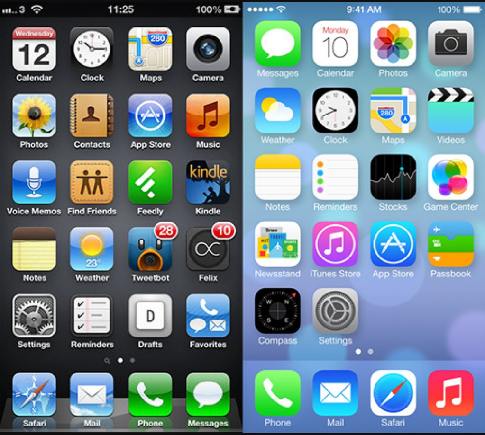
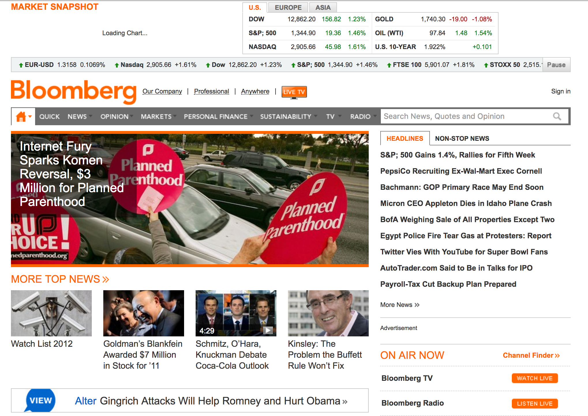
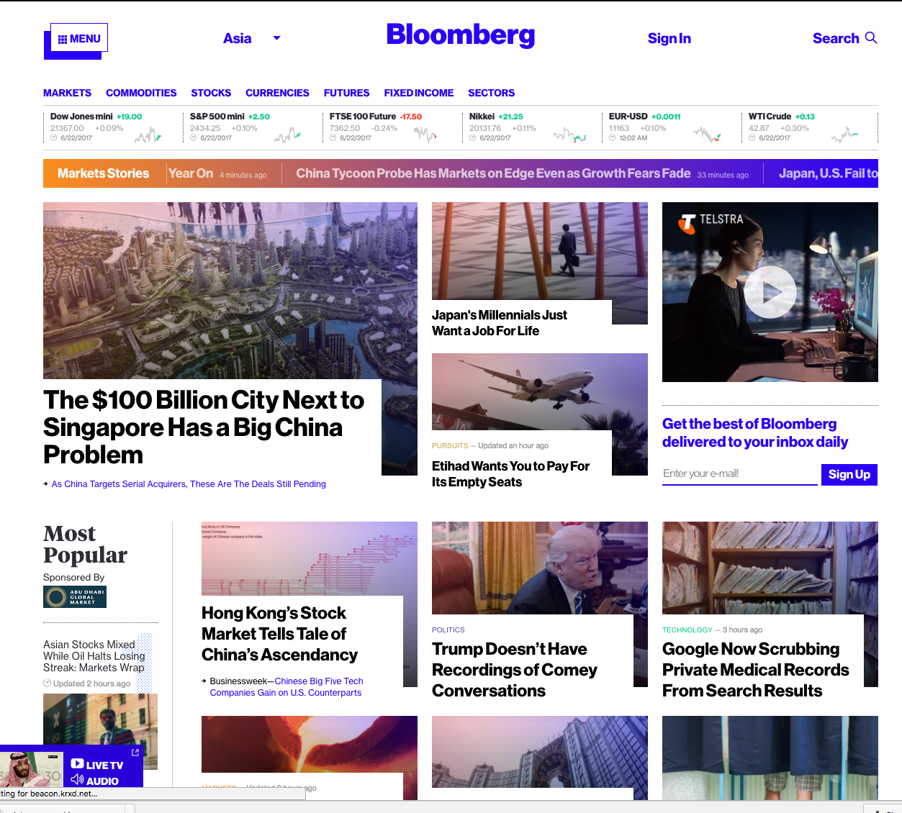

# ui/ux mobile first

---
  https://github.com/denistsoi/talks/2017-06/ui-ux-mobile-first/

---

### intro:
  - Front-end engineer, General Assembly Alumni (2013)
  - Former Seed Alpha
  - Committee Member: Think.HK / Hong Kong Web Dev Group

---

who this is for:
  - developers who want to know more about ux/ui patterns
  - designers who want to know more about digital

who this lecture is _**not**_ aimed at:
  - experienced ux practitioners
  - digital designers _especially those with professional/agency experience_

---

Est Time: 45 mins

#### Overview:
  - understanding ui/ux
    - skeuomorphism
    - flat design
    - comparison
  - what do i need for good ux/ui?
    - principles for good ux
      - mobile
      - desktop
    - how to optimise for mobile?
  - know when to go against the grain
    - case studies
      - bloomberg
      - king kong
  - practical applications  
    * Fintech  
    * Insurance  
    * Regtech  

  - real life example

  - Q&A

---

## understanding ui/ux - mobile first

> A people without the knowledge of their past history, origin and culture is like a tree without roots. - Marcus Garvey

  

### this is the pinnacle of when mobile became important.

So what do we need to know about ui design?

whenever you're creating something new, you need to create reference points for early adopters to adapt to new environments.

---
### what is skeuomorphism?

the concept of making items resemble their real world counter parts.

#### real-life examples:
- serif || gothic fonts resembles cursive handwriting  
- electric kettles resemble tradition open fire kettles  

---
### what is flat design?

the concept of emphasizing minimalism

> why was it used?

  - adoption rate for mobile reached a majority of users
  - skeuomorphism began to look outdated (iphone released in 2007)

  // flat design came out in 2013  
  // material design released in 2014  

#### real-life examples:

- sans serif font / helvetica [nyc subway: ref helvetica]
  [story about helvetica](http://www.aiga.org/the-mostly-true-story-of-helvetica-and-the-new-york-city-subway)
- japanese minimalism -> Zen

#### comparison skeuomorphism vs flat

  
<!--  notice how shadows are used  -->

  
<!--  notice camera / contacts and settings -->

---
# what do i need for good ux/ui?
---

  > we're gonna focus on a hackathon, we won't focus on premature optimisations, we'll gloss over that in a moment

---
## prinicples for good ux
---

- ask questions early on, what does your product try to solve?

  - generate hypothesies and validate/reject those assumptions.
  - be strong to adapt, whether to reject/pivot your product if the market information tells you there isn't a market fit.
  - if the market is telling you it's a hard sell, increase your company resources/ change pitch to cater for that market (ad spend/sales channels).
  - how does your clients interact with your product? is this the most effective method?

- ask whether you can increase ux with an app install, or via a web app (i.e. 100MB updates aren't ideal, especailly if you're on a 3G/usage contract).

- LINE HEIGHTS! (VERTICAL Rhythm)
- iA [ia](https://ia.net/topics/bringing-responsiveness-the-app-world/)

---
#### how to develop on respective platforms
---
  ### mobile

  - figure out what you're most comfortable to develop a prototype in; whether that is native iOS/Android, Responsive webpage or cross platform frameworks (React/Xamarin/Unity)

  ### desktop

  - native or browser?
  - what browser do you want to target? -
  - look at target browser adoption rates

  ### both

  - unified brand identity
  - responsive (if necessary)

---
## optimise for mobile
---

  - account for latency/connectivity (don't send lots of information)
  - compress assets
  - lazy load (defer loading)
  - optimize for screen sizes

  - remove visual elements if they aren't important

---
examples:

## airbnb

### before

### after

---
## uber

### before

### after

---

  # know when to go against the grain

---
## Case studies (design)

# Bloomberg

### before
  

---
    - reminds you of 90s design.
    - no real vertical grid design
    - informational importance is overlooked.
---

### after
  

---
    - breaks the grid
    - hierachy to titles - rich media (photos attrach more attention)
    - use of color gradient
---    

  # king kong movie poster

---

japanese movie posters in March 2017

### logan
  
### ghost in the shell

- Fairly minimalistic
- blending colors
- glitch style

---
## how does king kong usa poster compare?

### king kong usa

---

### king kong japan

- look at visual importance / layers, and how people are the smallest visually.

<!--  what does the translation say again? -->

---
<!-- pause -->
---

---
# practical application:
---

### Finance

- visualisations > institution side, harder sell
- client side > access to data

Case Study:

### Insurance

- brokering/ML, automation
- client > onboarding

### Regtech

- processing
- information

What value are you providing to your users?
how to tackle information overflow (infographics/visualizing numbers)
- https://medium.com/sketch-app-sources/building-a-sexy-dashboard-40831ea274a4
-

---
Example:

Tools used Sketchapp *(graphic design tool)*

A story:

Fintech hackathon Oct 2016 sponsored by HSBC:

---
Q&A.

---

resources:
- Gary Hustwit (Helvetica/Objectified)
- Art & Copy
- Jiro dreams of sushi
- Jodorowsky's Dune

Dribbble
Behance
medium -> look at product teams, UXPin, Freecodecamp/design
