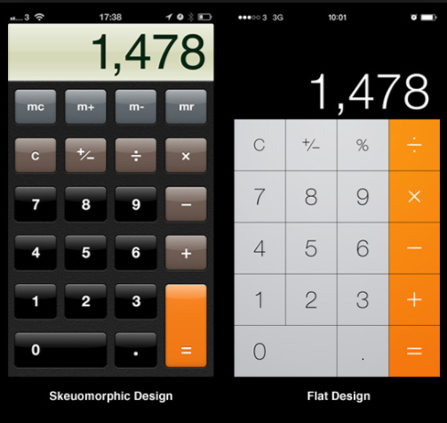
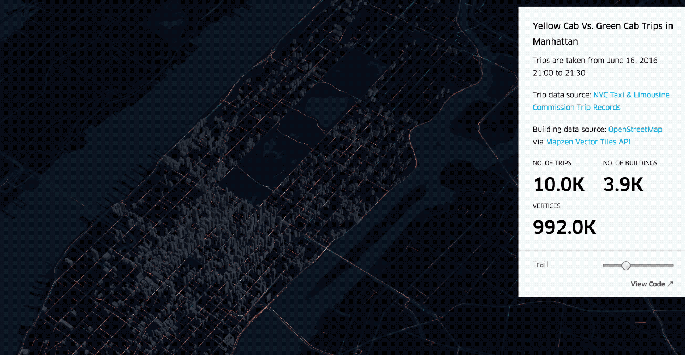
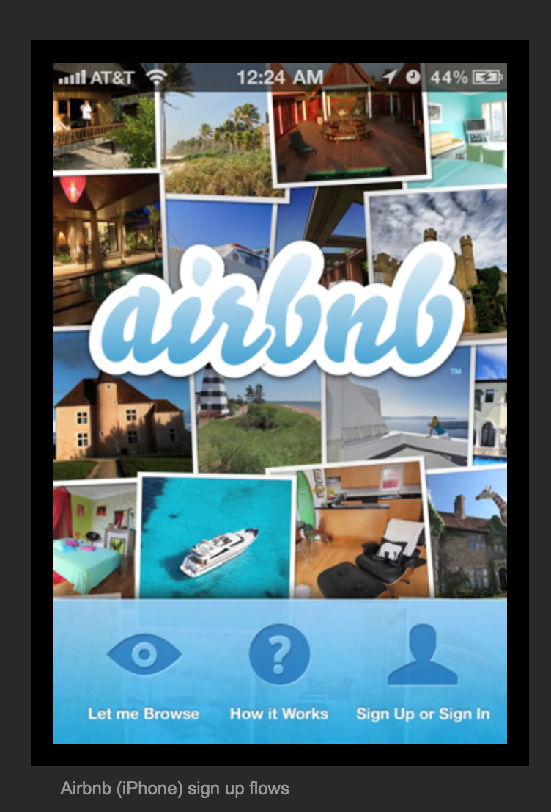
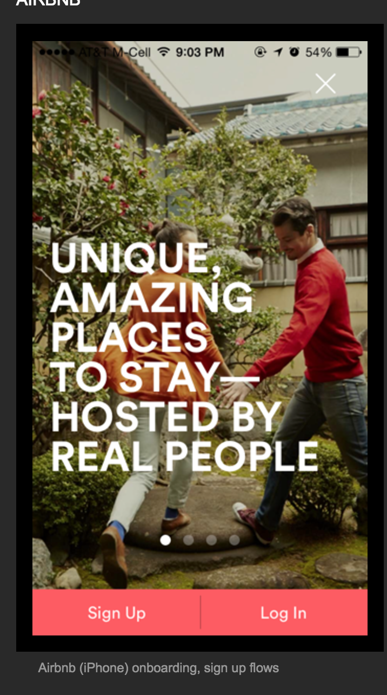
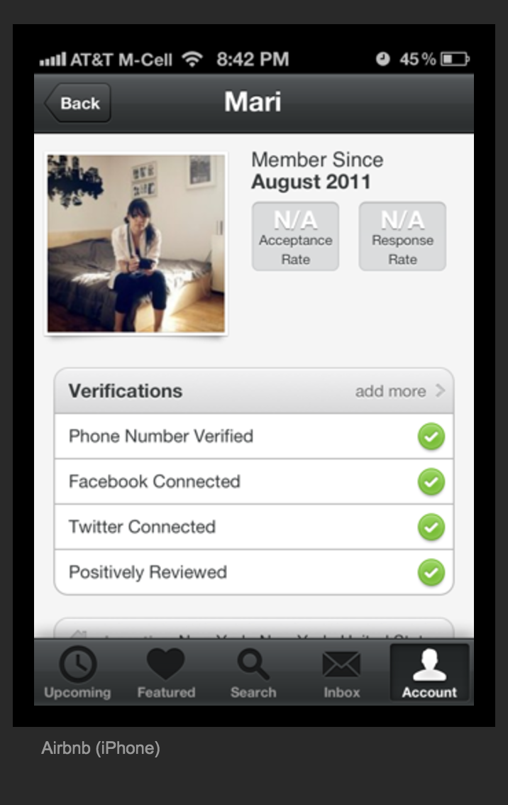
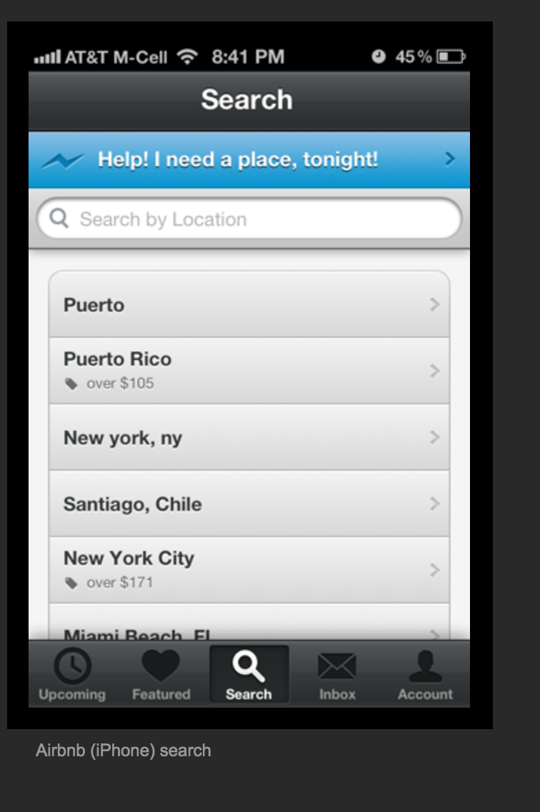
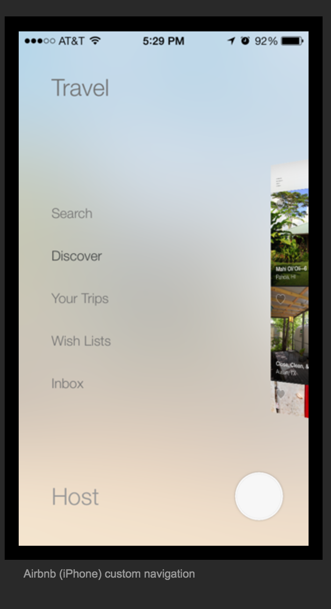
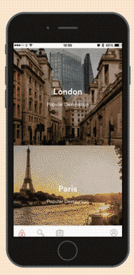
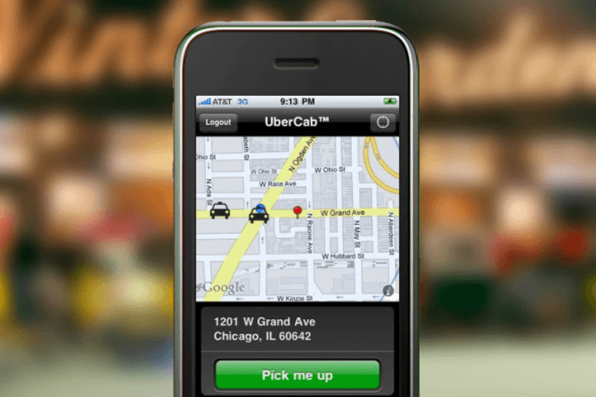
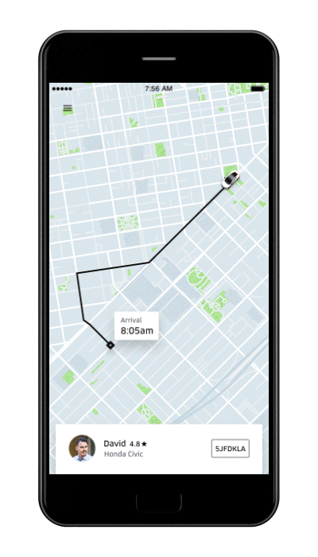

# ui/ux mobile first

---
  https://github.com/denistsoi/talks/2017-06/ui-ux-mobile-first/

---

### intro:
  - Front-end engineer, General Assembly Alumni (2013)
  - Former Seed Alpha
  - Committee Member: Think.HK / Hong Kong Web Dev Group

---

who this is for:
  - developers who want to know more about ux/ui patterns
  - designers who want to know more about digital

who this lecture is _**not**_ aimed at:
  - experienced ux practitioners
  - digital designers _especially those with professional/agency experience_

---

Est Time: 45 mins

#### Overview:
  - understanding ui/ux
    - skeuomorphism
    - flat design
    - comparison
  - what do i need for good ux/ui?
    - principles for good ux
      - mobile
      - desktop
    - how to optimise for mobile?
  - know when to go against the grain
    - case studies
      - bloomberg
      - king kong
  - practical applications  
    * Fintech  
    * Insurance  
    * Regtech  

  - real life example

  - Q&A

---

## understanding ui/ux - mobile first

> A people without the knowledge of their past history, origin and culture is like a tree without roots. - Marcus Garvey

  

### this is the pinnacle of when mobile became important.

So what do we need to know about ui design?

whenever you're creating something new, you need to create reference points for early adopters to adapt to new environments.

---
### what is skeuomorphism?

the concept of making items resemble their real world counter parts.

#### real-life examples:
- serif || gothic fonts resembles cursive handwriting  
- electric kettles resemble tradition open fire kettles  

---
### what is flat design?

the concept of emphasizing minimalism

> why was it used?

  - adoption rate for mobile reached a majority of users
  - skeuomorphism began to look outdated (iphone released in 2007)

  // flat design came out in 2013  
  // material design released in 2014  

#### real-life examples:

- sans serif font / helvetica [nyc subway: ref helvetica]
  [story about helvetica](http://www.aiga.org/the-mostly-true-story-of-helvetica-and-the-new-york-city-subway)
- japanese minimalism -> Zen

#### comparison skeuomorphism vs flat

  
<!--  notice how shadows are used  -->

  
<!--  notice camera / contacts and settings -->

---
# what do i need for good ux/ui?
---

  > our focus is on hackathons, so we won't focus on premature optimisations too much.

---
## prinicples for good ux
---

- ask **questions** early on, what does your product try to solve?

  - generate **hypothesies** and validate/reject those assumptions.
  - be **strong** to adapt, whether to reject/pivot your product if the market information tells you there isn't a market fit.
  - if the market is telling you it's a hard sell, increase your company resources/ change pitch to cater for that market (ad spend/sales channels).
  - how do your clients interact with your product? is this the most **effective** method?

- ask whether you can need an app install, or can a web app do the job (100MB updates aren't ideal, especailly if you're on a 3G/usage contract).

- LINE HEIGHTS! (VERTICAL Rhythm)
- grid layouts (why they're important)
- use familiar visual representations (hamburgers)

- leverage other knowledge domains if encountering challenges (data science/ml/automation)

  

---
#### how to develop on respective platforms
---

### mobile

  - figure out what you're most comfortable to develop a prototype in; whether that is native iOS/Android, Responsive webpage or cross platform frameworks (React/Xamarin/Unity)
  - thumbs are big - so account for that when designing buttons (increase padding)
  - only animate when neceassary (i.e. factor for low end devices)
  - leverage native functionality (push notifications / etc)

### desktop

  - native or browser?
  - what browser do you want to target? -
  - look at target browser adoption rates

### both

  - unified brand identity
  - responsive (if necessary)
  - visual representations for information (icons/colors)
  - add mouse trackers to generate heatmaps (gives you as a developer feedback on how to improve)

---
## optimise for mobile
---

  - account for latency/connectivity (don't send lots of information)
  - compress assets
  - lazy load (defer loading)
  - optimize for screen sizes

  - remove visual elements if they aren't important

---
examples:

# airbnb
---
## login

### before
  

### after
  

---
## profile

### before
  

### after
  

---
## profile

### before
  

### after
  

### user-flow
  

---
## uber

### before

  

### after

  

<!--  imporantance on map / position -->
<!--  fluid transitions -->

---

  # know when to go against the grain

---
## Case studies (design)

# Bloomberg

### before
  

---
    - reminds you of 90s design.
    - no real vertical grid design
    - informational importance is overlooked.
---

### after
  

---
    - breaks the grid
    - hierachy to titles - rich media (photos attract more attention)
    - use of color gradient
---    

  # king kong movie poster

---

Japanese movie posters in March 2017

### logan
  
### ghost in the shell

- Fairly minimalistic
- blending colors
- glitch style

---
## how does king kong usa poster compare?

### king kong usa

---

### king kong japan

- look at visual importance / layers, and how people are the smallest visually.

<!--  what does the translation say again? -->

<!-- summarise and recollect -->
<!-- pause -->

---
# practical application:
---

### Finance

#### possible pain points:

    - data overload [medium-post](https://medium.com/seed-alpha/how-to-manage-information-overload-bf2693d3484f)
    - data can often be restricted/visually dull

#### questions:

    - what sector are you targetting here? (client acquisition/new clients)?
    - what pain points does a company have day-to-day?
    - how do clients interact with the bank (here chatbots provide a lot of value)

### Insurance

#### possible pain points:

    - too many forms, lack of design intent
    - repetitive tasks, candidate for automation [Fukoku Mutual Life Insurance replaces 34 workers](https://www.theguardian.com/technology/2017/jan/05/japanese-company-replaces-office-workers-artificial-intelligence-ai-fukoku-mutual-life-insurance)

#### questions

    - do users/clients care enough (is it lack of public awareness or too much competition?)
    - what value add can companies give to users/clients?
    - what do people care about when it comes to insurance? too much choice or can't decide?

### Regtech

Note: (not familiar with work processes here)

#### questions

    - how does the industry operate?
    - what is a typical pain point for companies?
    - how do companies engage with clients?
    - how do companies attract new clients? (user perspective, why do clients reach out to companies...)

---
### Example:

Tools used Sketchapp *(graphic design tool)*

A story:

Fintech hackathon Oct 2016 sponsored by HSBC:

How I pitched it. mention one team member as guinea pig.

1. tried to develop app from scratch, threw it out after an hour on the realisation that it was a one person team.
2. Asked the question "what are you trying to solve"
3. Reviewed design of current financial/banking apps
4. found template resources online (you can use github template/tutorials if you already know how to develop)
5. started designing based around existing brand identity.
6. spent a few hours before going home.

### next day

7. threw everything out cause it sucked
8. started again basing template on ui-templates and similarity to brand
9. link screens to invisionapp to categorise flow
10. demo

### what i learned
- go with your instinct, you know what works and what doesn't
- have someone on hand to review/discuss design
  it's for your own benefit to voice your thoughts and take mental breaks
- use existing frameworks to prototype in your preferred code base
- push screens out the door and keep the pitch simple

---
Q&A.

---

resources:
- Gary Hustwit (Helvetica/Objectified)
- Art & Copy
- Jiro dreams of sushi
- Jodorowsky's Dune

- Art of the title http://www.artofthetitle.com/
- Dribbble
- Behance
- medium -> look at product FB/dropbox/google teams, UXPin,
- Freecodecamp/design

---
talks

### the blossoming world of data Visualisation

[Credit to Droste](https://slides.com/droste/harbour-front/)

### don't rely on dropdowns
[youtube video](https://www.youtube.com/embed/hcYAHix-riY)

### your users have a limited decision quota

[youtube video](https://www.youtube.com/embed/1pq5jnM1C-A)
